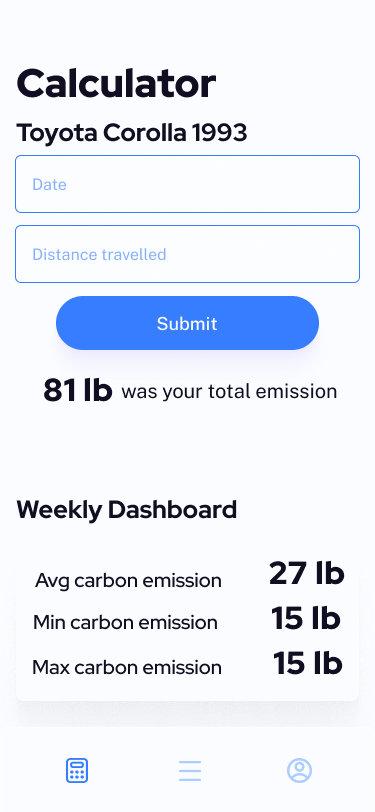
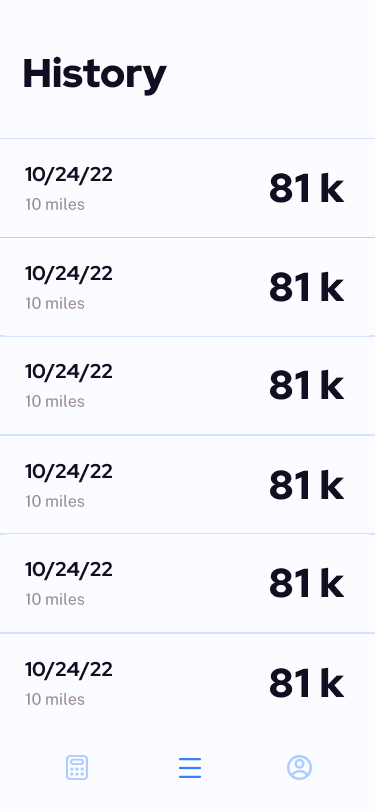

Emissi0n - README 
===

# Emissi0n 

## Table of Contents
1. [Overview](#Overview)
1. [Product Spec](#Product-Spec)
1. [Wireframes](#Wireframes)
2. [Schema](#Schema)

## Overview
### Description
Estimates carbon emission based on vehicle type and distance travelled to reduce global warming and helps user set goal to reduce their carbon emission.

### App Evaluation
[Evaluation of your app across the following attributes]
- **Category:** Transportation/Enviroment/Goal
- **Mobile:** This app would be primarily developed for mobile but would perhaps be just as viable on a computer or smart watch. 
- **Story:** Calculates user's emission and summerizes users emission pattern. Allows user to set goal and track their carbon emission to make sure they are under. 
- **Market:** Vehicle owners in particular but anyone can use it
- **Habit:** Users would preferably enter every time they travelled
- **Scope:** Calculate users emission and give emission summary. Then perhaps integrate with maps/directions apps such as google maps, apple map or waze to reduece carbon emission.

## Product Spec

### 1. User Stories (Required and Optional)

**Required Must-have Stories**

* User sign up/login page 
* Profile page 
    * Emission history
    * Personal information (i.e. car type)
* Calculator page
    * User enters information 
* Results page

**Optional Nice-to-have Stories**

* Alternative transportation methods
    * Calculate emissions saved (e.g., biking, carpool, public transportation)
* Various vehicles to choose from (make/model)
* GPS logs distance traveled (no need for input, calculation is automatic)
* Feed to share their progress in their goal to with other user
* TBD . . .

### 2. Screen Archetypes

* Login
   * User enters their login credentials
   * Once logged in, they will automatically be sent to the home screen upon opening the app 
* Register
   * User will register, enter vehicle info, their goal and create an account
* Calculator/ Weekly Summary
   * Displays report on this weeks emissions
      * avg emissions for the week
      * min emissions for the week
      * max emissions for the week
      * total emissions for the week
   * User enters information 
        * date
        * enter milage traveled
* History 
   * Displays history of emissions
       * date 
       * distance travelled
       * total emmision for that ride
* Goal Progress 
    * Graphic display of how well user is doing on their set monthly progress
    * How many months they met their goal
    * Update the goal
* Update Goal
    * Enter new goal


### 3. Navigation

**Tab Navigation** (Tab to Screen)

* calculator page 
* History
* goal progress

**Flow Navigation** (Screen to Screen)

* Forced login
   * goes to sign up page
   * goes to sign page
* Goals Progress page
   * Can go to update page  

## Wireframes


### [BONUS] Digital Wireframes & Mockups
           
           
  

### [BONUS] Interactive Prototype

## Schema 
### Models
#### User

   | Property      | Type     | Description |
   | ------------- | -------- | ------------|
   | userId        | String   | unique id of the user (default field) |
   | userName      | String   | username to login |
   | password      | String   | password to login |

#### Vehicle

   | Property      | Type     | Description |
   | ------------- | -------- | ------------|
   | vehicleId     | String   | unique id for the vehicle (default field) |
   | userId        | String   | unique id of the user who owns the vehicle |
   | make          | String   | make of the vehicle |
   | model         | String   |  model of the vehicle | 
   | year          | Number   | year the vehicle was made | 

#### Goal

   | Property      | Type     | Description |
   | ------------- | -------- | ------------|
   | goalId        | String   | unique id for the goal (default field) |
   | userId        | String   | unique id of the user |
   | month         | String   | month that the goal applies to |
   | emissionGoal  | Number   |  emission goal set by the user  | 
   
#### VehicleEmission

   | Property           | Type     | Description |
   | ------------------ | -------- | ------------|
   | vehicleEmissionId | String   | unique id for the vehicle emission (default field) |
   | userId             | String   | unique id of the user |
   | vehicleId          | String   | id of the vehicle |
   | distance           | Number   | distance traveled  |
   | emission           | Number   | emissions resulting from travel |
   | date               | DateTime | date of the vehicle emission | 
   
### Networking
- Register 
    - (Create/POST) Create new user object
    ```swift 
    let user = PFObject(className:"User")
    user["userName"] = "Michael Scott"
    user["password"] = "paper"
    user.saveInBackground { (succeeded, error)  in
        if (succeeded) {
            print("The object has been saved.")
        } else {
            print(error)
        }
    }
    ```
    - (Create/POST) Create new vehicle object
    ```swift 
    let vehicle = PFObject(className:"Vehicle")
    vehicle["userId"] = "MichaelScott1"
    vehicle["make"] = "GMC"
    vehicle["model"] = "Hummer"
    vehicle["year"] = "2022"
    vehicle.saveInBackground { (succeeded, error)  in
        if (succeeded) {
            print("The object has been saved.")
        } else {
            print(error)
        }
    }
    ```
    
- Calculator/ Weekly Summary    
    - (Create/POST) Create new vehicle emission
    ```swift 
    let emission = PFObject(className:"VehicleEmission")
    emission["userId"] = currentUser
    emission["vehicleId"] = currentUser.vehicleId
    emission["date"] = emissionForm.date
    emission["distance"] = emissionForm.distance 
    emission["emission"] = emissionCalculation(make, model, year, emissionForm.distance) // we will have to create a function emissionCalculation that takes these parameters, makes an API request, and outputs the emission

    emission.saveInBackground { (succeeded, error)  in
        if (succeeded) {
            print("The object has been saved.")
        } else {
            print(error)
        }
    }
    ```
    - (Read/GET) Vehicle emission data for the week
    ```swift
    let query = PFQuery(className:"VehicleEmission")
    query.whereKey("userId", equalTo: currentUser)
    query.findObjectsInBackground { (emissions: [PFObject]?, error: Error?) in
    if let error = error { 
        print(error.localizedDescription)
    } else if let emissions = emisssions {
        print("Successfully retrieved \(emissions.count) emissions.")
    ```
- History 
    - (Read/GET) Vehicle emission data for the week
    ```swift
    let query = PFQuery(className:"VehicleEmission")
    query.whereKey("userId", equalTo: currentUser)
    query.findObjectsInBackground { (emissions: [PFObject]?, error: Error?) in
    if let error = error { 
        print(error.localizedDescription)
    } else if let emissions = emisssions {
        print("Successfully retrieved \(emissions.count) emissions.")
    ```
- Goal Progress 
    - (Read/GET) Vehicle emission goal for the month
    ```swift
    let query = PFQuery(className:"Goal")
    query.whereKey("userId", equalTo: currentUser)
    query.findObjectsInBackground { (goals: [PFObject]?, error: Error?) in
    if let error = error { 
        print(error.localizedDescription)
    } else if let emissions = emisssions {
        print("Successfully retrieved \(goals.count) goals.")
    ```
- Update Goal
    - (Create/POST) Create/update goals for each month
    ```swift 
    let goal = PFObject(className:"Goal")
    goal["userId"] = currentUser
    goal["month"] = emissionForm.month
    goal["emissionGoal"] = emissionForm.emissionGoal
    goal.saveInBackground { (succeeded, error)  in
        if (succeeded) {
            print("The object has been saved.")
        } else {
            print(error)
        }
    }
    ```
